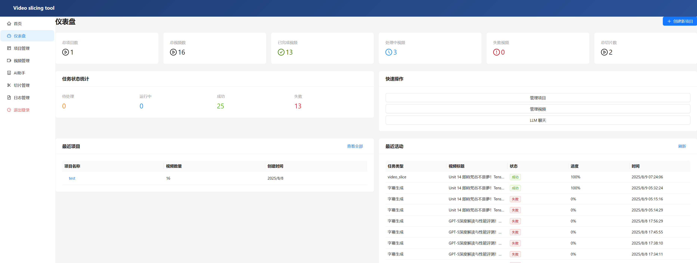
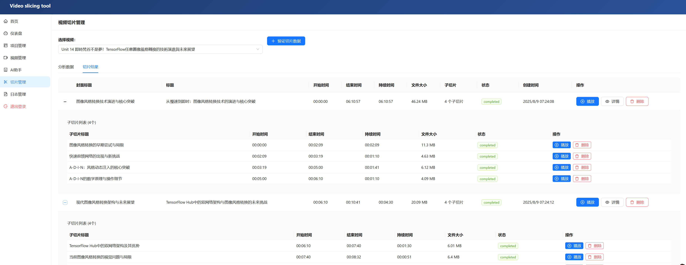

# YouTube Slicer

🎥 **AI-Powered Video Processing Platform** - Download, analyze, and slice YouTube videos with intelligent content segmentation using advanced AI.


[🇨🇳 中文版](README.zh.md) | [🇺🇸 English](README.md)

## 🚀 Features

### 🎬 Video Processing
- **YouTube Video Download**: Download videos with real-time progress tracking
- **Audio Extraction**: Extract and split audio by silence detection
- **Transcript Generation**: High-quality ASR-powered transcripts with timestamps using SenseVoice ASR
- **Video Slicing**: AI-powered content segmentation
- **Multi-format Support**: Various video quality options

### 🤖 AI-Powered Analysis
- **LLM Integration**: Advanced AI content analysis using OpenAI
- **Intelligent Segmentation**: Automatically identify video segments
- **Topic Extraction**: Identify main topics and subtopics
- **Metadata Generation**: Auto-generate titles and descriptions

### ⚡ Real-time Features
- **Live Progress Tracking**: WebSocket-based real-time updates
- **Multi-stage Processing**: Track progress through processing pipeline
- **Background Processing**: Celery-powered async task processing
- **WebSocket Communication**: Efficient real-time messaging

### 🏗️ Architecture
- **Microservices**: Scalable containerized services
- **Modern Stack**: FastAPI + React + TypeScript
- **Object Storage**: MinIO for scalable file storage
- **Database**: Multi-database support (SQLite/PostgreSQL/MySQL)

## 📸 Project Showcase

### 🏠 Main Interface
| Dashboard Overview | Video Management |
|-------------------|------------------|
|  |  |

### 🤖 AI-Powered Video Analysis
| Intelligent Slicing | ASR Processing | SRT Results |
|-------------------|----------------|-------------|
|  |  |  |

## 🛠️ Technology Stack

### Backend
- **FastAPI** - Modern Python web framework
- **SQLAlchemy** - Async ORM
- **Celery** - Distributed task queue
- **Redis** - Caching and message broker
- **MinIO** - S3-compatible object storage
- **OpenAI/LLM** - AI integration
- **SenseVoice ASR** - High-quality speech recognition service
- **FFmpeg** - Video/audio processing
- **yt-dlp** - YouTube downloader

### Frontend
- **React 18** - Modern React with TypeScript
- **Ant Design** - Enterprise UI components
- **Zustand** - Lightweight state management
- **Vite** - Fast build tool
- **Tailwind CSS** - Utility-first CSS
- **React Router** - Client-side routing
- **React Query** - Data fetching and caching
- **React Player** - Video player component
- **React Hot Toast** - Toast notifications

### Infrastructure
- **Docker** - Containerization
- **MySQL 8.0** - Production database
- **SQLite** - Development database
- **Redis 7** - Message broker
- **MinIO** - Object storage

## 🎤 ASR Service Integration

This project integrates with **SenseVoice ASR** for high-quality speech recognition and subtitle generation.

### Service Details
- **Service**: SenseVoice ASR Docker Service
- **Repository**: [https://github.com/youyouhe/sensevoice-asr-docker](https://github.com/youyouhe/sensevoice-asr-docker)
- **Purpose**: Provides high-accuracy Chinese speech recognition with timestamp support
- **API Endpoint**: Configurable via `ASR_SERVICE_URL` environment variable

### Integration Features
- **Automatic Audio Processing**: Split audio files and send to ASR service
- **Retry Mechanism**: Built-in retry logic with exponential backoff
- **Timestamp Alignment**: Accurate time synchronization with video content
- **SRT Format Output**: Professional subtitle format with proper timing
- **Multi-language Support**: Configurable language detection (default: Chinese)

### Configuration
The ASR service URL is configured via:
```bash
# In .env file
ASR_SERVICE_URL=http://your-asr-server:5001/asr

# In docker-compose.yml
environment:
  - ASR_SERVICE_URL=http://asr-service:5001/asr
```

### Service Requirements
- Separate Docker container deployment
- Network accessibility from the main application
- Sufficient computational resources for audio processing
- Recommended: GPU acceleration for better performance

### Performance Metrics (GPU Accelerated)
Based on actual production logs, SenseVoice ASR demonstrates excellent performance:

- **Real-time Factor (RTF)**: 0.045 (22x faster than real-time)
- **Processing Speed**: ~7.46 segments per second
- **Latency per Segment**: ~146ms (including data loading, feature extraction, and inference)
- **Throughput**: Equivalent to processing 22-37 seconds of audio per second

**Performance Breakdown**:
- **Data Loading**: 4ms per segment
- **Feature Extraction**: 8ms per segment  
- **Model Inference**: 132-134ms per segment (GPU accelerated)
- **Total Processing Time**: 146ms per segment

This high performance enables efficient processing of long-form videos with near-instantaneous subtitle generation.

## 📋 Processing Pipeline

The system follows a sophisticated multi-stage processing pipeline:

1. **Preparing** (0-5%) - Initial setup and validation
2. **Download** (5-50%) - YouTube video download
3. **Merging** (50-55%) - Audio/video stream merging
4. **Converting** (55-60%) - Format conversion
5. **Audio Extraction** (60-70%) - Audio extraction
6. **Audio Splitting** (70-80%) - Silence-based splitting
7. **ASR Processing** (80-90%) - Speech recognition with OpenAI Whisper
8. **LLM Analysis** (90-95%) - AI content analysis
9. **Video Slicing** (95-100%) - Final segmentation
10. **Complete** (100%) - Processing finished

## 🚀 Quick Start

### Prerequisites
- Python 3.8+
- Node.js 16+
- Docker & Docker Compose
- FFmpeg
- Redis
- MinIO

### Development Setup

#### Backend
```bash
cd backend
pip install -r requirements.txt
pip install -r requirements-audio.txt

# Start services
docker-compose up -d redis minio

# Run migrations
alembic upgrade head

# Start backend
uvicorn app.main:app --reload --host 0.0.0.0 --port 8001

# Start Celery worker
celery -A app.core.celery worker --loglevel=info
celery -A app.core.celery beat --loglevel=info  # for scheduled tasks
```

#### Frontend
```bash
cd frontend
npm install
npm run dev
```

### Docker Deployment
```bash
# Full stack
docker-compose up -d

# Scale workers
docker-compose up -d --scale celery-worker=3
```

## 🔧 Configuration

### Environment Variables

#### Backend (.env)
```env
DATABASE_URL=sqlite+aiosqlite:///./youtube_slicer.db
REDIS_URL=redis://localhost:6379
MINIO_ENDPOINT=localhost:9000
MINIO_ACCESS_KEY=minioadmin
MINIO_SECRET_KEY=minioadmin
OPENAI_API_KEY=your_openai_key
YOUTUBE_COOKIES_FILE=/path/to/cookies.txt
```

#### Frontend (.env)
```env
REACT_APP_API_URL=http://localhost:8001
```

## 📖 API Documentation

### Authentication
- `POST /api/v1/auth/register` - User registration
- `POST /api/v1/auth/login` - User login
- `POST /api/v1/auth/google` - Google OAuth

### Projects
- `GET /api/v1/projects` - List user projects
- `POST /api/v1/projects` - Create project
- `GET /api/v1/projects/{id}` - Get project details

### Videos
- `POST /api/v1/videos/download` - Download YouTube video
- `GET /api/v1/videos` - List videos
- `GET /api/v1/videos/{id}/progress` - Get download progress
- `GET /api/v1/videos/{id}/download-url` - Get MinIO download URL

### Processing
- `POST /api/v1/processing/extract-audio/{video_id}` - Extract audio
- `POST /api/v1/processing/generate-transcript/{video_id}` - Generate transcript
- `POST /api/v1/processing/analyze-with-llm/{video_id}` - AI analysis
- `POST /api/v1/processing/create-slices/{video_id}` - Create video slices

### WebSocket
- `ws://localhost:8001/ws/progress/{token}` - Real-time progress updates

## 🗂️ Project Structure

```
youtube-slicer/
├── backend/                    # FastAPI backend
│   ├── app/
│   │   ├── api/v1/            # API endpoints
│   │   ├── core/              # Core configuration
│   │   ├── models/            # SQLAlchemy models
│   │   ├── schemas/           # Pydantic schemas
│   │   ├── services/          # Business logic
│   │   ├── tasks/             # Celery tasks
│   │   └── main.py            # Application entry point
│   ├── requirements.txt       # Python dependencies
│   ├── requirements-audio.txt # Audio processing dependencies
│   ├── tests/                 # Test suite
│   ├── alembic/              # Database migrations
│   └── Dockerfile            # Backend container
├── frontend/                 # React frontend
│   ├── src/
│   │   ├── components/       # Reusable components
│   │   ├── pages/            # Page components
│   │   ├── services/         # API services
│   │   ├── store/            # State management
│   │   └── types/            # TypeScript types
│   ├── package.json          # Node.js dependencies
│   ├── tailwind.config.js    # Tailwind CSS configuration
│   └── vite.config.ts        # Vite configuration
├── docker-compose.yml       # Full stack orchestration
└── CLAUDE.md               # Claude Code instructions
```

## 🔍 Database Schema

### Core Entities
- **User**: Authentication and user management
- **Project**: Organizes videos into projects
- **Video**: YouTube video metadata and processing status
- **ProcessingTask**: Tracks background processing tasks
- **Transcript**: Generated subtitles and ASR results
- **VideoSlice**: AI-generated video segments
- **LLMAnalysis**: AI analysis results for video content
- **AudioTrack**: Audio processing metadata
- **Slice**: Video slice metadata and processing status

## 🧪 Testing

### Backend Tests
```bash
cd backend
pytest tests/
pytest tests/test_video_api.py -v
pytest tests/test_project_api.py -v
pytest tests/test_minio_service.py -v
```

### Frontend Tests
```bash
cd frontend
npm test
npm run lint
```

### Manual Testing
```bash
# Test video download
curl -X POST http://localhost:8001/api/v1/videos/download \
  -H "Content-Type: application/json" \
  -H "Authorization: Bearer YOUR_TOKEN" \
  -d '{"url": "https://www.youtube.com/watch?v=VIDEO_ID", "project_id": 1}'

# Test WebSocket connection
curl -i -N \
  -H "Connection: Upgrade" \
  -H "Upgrade: websocket" \
  -H "Sec-WebSocket-Key: dGhlIHNhbXBsZSBub25jZQ==" \
  -H "Sec-WebSocket-Version: 13" \
  http://localhost:8001/ws/progress/YOUR_TOKEN
```

## 🐳 Docker Commands

### Development
```bash
# Start all services
docker-compose up -d

# View logs
docker-compose logs -f backend
docker-compose logs -f celery-worker
docker-compose logs -f redis
docker-compose logs -f minio

# Stop services
docker-compose down

# Clean up volumes
docker-compose down -v
```

### Production
```bash
# Production deployment
docker-compose -f docker-compose.prod.yml up -d

# Scale workers
docker-compose up -d --scale celery-worker=3

# View resource usage
docker-compose ps
docker-compose stats
```

## 🔧 Common Issues & Solutions

### Backend
- **FFmpeg not found**: Install system-wide or set `FFMPEG_PATH`
- **Redis connection**: Check Redis is running on localhost:6379
- **MinIO connection**: Verify MinIO console at http://localhost:9001
- **YouTube cookies**: Use valid cookies.txt for age-restricted content

### Frontend
- **CORS issues**: Backend CORS configured for localhost:3000
- **WebSocket connection**: Token must be valid JWT
- **Build errors**: Check Node.js version compatibility (16+)

## 🤝 Contributing

1. Fork the repository
2. Create a feature branch
3. Make your changes
4. Add tests for new functionality
5. Run the test suite
6. Submit a pull request

## 📄 License

This project is licensed under the MIT License - see the LICENSE file for details.

## 🙏 Acknowledgments

- **FastAPI** - Modern, fast web framework
- **React** - JavaScript library for building user interfaces
- **OpenAI** - AI-powered content analysis
- **FFmpeg** - Multimedia processing framework
- **yt-dlp** - YouTube video downloader
- **MinIO** - High-performance object storage

## 📞 Support

For support and questions:
- Create an issue on GitHub
- Check the documentation
- Review the troubleshooting section

## 💝 Support the Project

If you find this project helpful and would like to support its continued development, consider making a donation. Your support helps maintain and improve the project!

### WeChat Payment
Scan the QR code below to support the author:

<a href="images/IMG_1639.JPG" target="_blank">
  
</a>

### Ways to Support
- **One-time donation**: Any amount is appreciated
- **Project sponsorship**: For businesses using this project commercially
- **Feature requests**: Priority development for sponsored features
- **Bug fixes**: Expedited resolution for supported issues

All contributions go directly towards:
- 🖥️ Server costs and infrastructure
- 🔧 Tool licenses and subscriptions  
- 📚 Documentation improvements
- 🚀 New feature development

---

**Built with ❤️ using modern web technologies and AI**

[](https://github.com/your-username/slice-youtube)
[](https://github.com/your-username/slice-youtube)