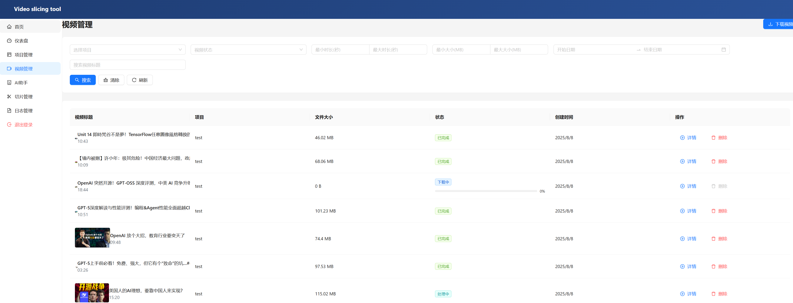
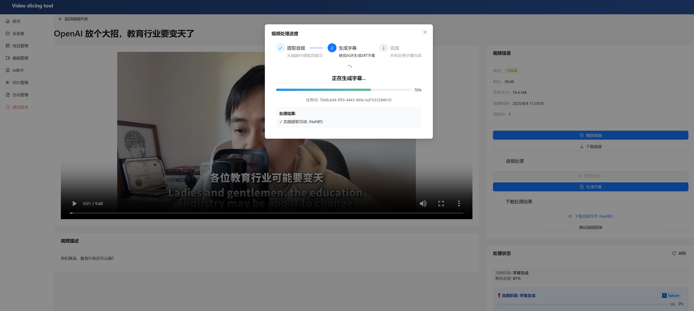

# YouTube 视频切片器

🎥 **AI 驱动的视频处理平台** - 使用先进 AI 下载、分析和切片 YouTube 视频，实现智能内容分割。


[🇨🇳 中文版](README.zh.md) | [🇺🇸 English](README.md)

## 🚀 功能特性

### 🎬 视频处理
- **YouTube 视频下载**：实时进度跟踪下载视频
- **音频提取**：提取并按静音检测分割音频
- **字幕生成**：基于 SenseVoice ASR 的高质量时间戳字幕生成
- **视频切片**：AI 驱动的内容分割
- **多格式支持**：多种视频质量选项

### 🤖 AI 驱动分析
- **LLM 集成**：使用 OpenAI 进行高级 AI 内容分析
- **智能分割**：自动识别视频段落
- **主题提取**：识别主要主题和子主题
- **元数据生成**：自动生成标题和描述

### ⚡ 实时功能
- **实时进度跟踪**：基于 WebSocket 的实时更新
- **多阶段处理**：跟踪处理管道进度
- **后台处理**：Celery 驱动的异步任务处理
- **WebSocket 通信**：高效的实时消息传递

### 🏗️ 架构
- **微服务**：可扩展的容器化服务
- **现代技术栈**：FastAPI + React + TypeScript
- **对象存储**：MinIO 可扩展文件存储
- **数据库**：多数据库支持（SQLite/PostgreSQL/MySQL）

## 📸 项目展示

### 🏠 主界面
| 仪表板概览 | 视频管理 |
|-----------|----------|
|  |  |

### 🤖 AI 驱动视频分析
| 智能切片 | ASR 处理 | SRT 结果 |
|----------|----------|----------|
|  |  |  |

## 🛠️ 技术栈

### 后端
- **FastAPI** - 现代 Python Web 框架
- **SQLAlchemy** - 异步 ORM
- **Celery** - 分布式任务队列
- **Redis** - 缓存和消息代理
- **MinIO** - S3 兼容对象存储
- **OpenAI/LLM** - AI 集成
- **SenseVoice ASR** - 高质量语音识别服务
- **FFmpeg** - 视频/音频处理
- **yt-dlp** - YouTube 下载器

### 前端
- **React 18** - 现代 React 与 TypeScript
- **Ant Design** - 企业级 UI 组件
- **Zustand** - 轻量级状态管理
- **Vite** - 快速构建工具
- **Tailwind CSS** - 实用优先的 CSS
- **React Router** - 客户端路由
- **React Query** - 数据获取和缓存
- **React Player** - 视频播放器组件
- **React Hot Toast** - Toast 通知

### 基础设施
- **Docker** - 容器化
- **MySQL 8.0** - 生产数据库
- **SQLite** - 开发数据库
- **Redis 7** - 消息代理
- **MinIO** - 对象存储

## 🎤 ASR 服务集成

本项目集成了 **SenseVoice ASR** 服务，用于高质量语音识别和字幕生成。

### 服务详情
- **服务**: SenseVoice ASR Docker 服务
- **项目地址**: [https://github.com/youyouhe/sensevoice-asr-docker](https://github.com/youyouhe/sensevoice-asr-docker)
- **用途**: 提供高精度中文语音识别和时间戳支持
- **API 端点**: 通过 `ASR_SERVICE_URL` 环境变量配置

### 集成特性
- **自动音频处理**: 分割音频文件并发送到ASR服务
- **重试机制**: 内置指数退避重试逻辑
- **时间戳对齐**: 与视频内容的精确时间同步
- **SRT 格式输出**: 专业字幕格式，时间精确
- **多语言支持**: 可配置语言检测（默认：中文）

### 配置方式
ASR 服务 URL 通过以下方式配置：
```bash
# 在 .env 文件中
ASR_SERVICE_URL=http://your-asr-server:5001/asr

# 在 docker-compose.yml 中
environment:
  - ASR_SERVICE_URL=http://asr-service:5001/asr
```

### 服务要求
- 独立的 Docker 容器部署
- 从主应用可网络访问
- 充足的计算资源用于音频处理
- 推荐：GPU 加速以获得更好性能

### 性能指标（GPU 加速）
基于实际生产环境日志，SenseVoice ASR 展现出卓越的性能表现：

- **实时因子 (RTF)**: 0.045（比实时快22倍）
- **处理速度**: 每秒约7.46个音频片段
- **单段延迟**: 约146毫秒（包括数据加载、特征提取和推理）
- **吞吐量**: 相当于每秒处理22-37秒的音频内容

**性能分解**：
- **数据加载**: 每片段4毫秒
- **特征提取**: 每片段8毫秒
- **模型推理**: 每片段132-134毫秒（GPU加速）
- **总处理时间**: 每片段146毫秒

这种高性能表现使得长视频的高效处理和近即时字幕生成成为可能。

## 📋 处理管道

系统遵循复杂的多阶段处理管道：

1. **准备** (0-5%) - 初始设置和验证
2. **下载** (5-50%) - YouTube 视频下载
3. **合并** (50-55%) - 音频/视频流合并
4. **转换** (55-60%) - 格式转换
5. **音频提取** (60-70%) - 音频提取
6. **音频分割** (70-80%) - 基于静音的分割
7. **ASR 处理** (80-90%) - 使用 OpenAI Whisper 的语音识别
8. **LLM 分析** (90-95%) - AI 内容分析
9. **视频切片** (95-100%) - 最终分割
10. **完成** (100%) - 处理完成

## 🚀 快速开始

### 先决条件
- Python 3.8+
- Node.js 16+
- Docker & Docker Compose
- FFmpeg
- Redis
- MinIO

### 开发设置

#### 后端
```bash
cd backend
pip install -r requirements.txt
pip install -r requirements-audio.txt

# 启动服务
docker-compose up -d redis minio

# 运行数据库迁移
alembic upgrade head

# 启动后端
uvicorn app.main:app --reload --host 0.0.0.0 --port 8001

# 启动 Celery 工作进程
celery -A app.core.celery worker --loglevel=info
celery -A app.core.celery beat --loglevel=info  # 定时任务
```

#### 前端
```bash
cd frontend
npm install
npm run dev
```

### Docker 部署
```bash
# 全栈部署
docker-compose up -d

# 扩展工作进程
docker-compose up -d --scale celery-worker=3
```

## 🔧 配置

### 环境变量

#### 后端 (.env)
```env
DATABASE_URL=sqlite+aiosqlite:///./youtube_slicer.db
REDIS_URL=redis://localhost:6379
MINIO_ENDPOINT=localhost:9000
MINIO_ACCESS_KEY=minioadmin
MINIO_SECRET_KEY=minioadmin
OPENAI_API_KEY=your_openai_key
YOUTUBE_COOKIES_FILE=/path/to/cookies.txt
```

#### 前端 (.env)
```env
REACT_APP_API_URL=http://localhost:8001
```

## 📖 API 文档

### 认证
- `POST /api/v1/auth/register` - 用户注册
- `POST /api/v1/auth/login` - 用户登录
- `POST /api/v1/auth/google` - Google OAuth

### 项目
- `GET /api/v1/projects` - 列出用户项目
- `POST /api/v1/projects` - 创建项目
- `GET /api/v1/projects/{id}` - 获取项目详情

### 视频
- `POST /api/v1/videos/download` - 下载 YouTube 视频
- `GET /api/v1/videos` - 列出视频
- `GET /api/v1/videos/{id}/progress` - 获取下载进度
- `GET /api/v1/videos/{id}/download-url` - 获取 MinIO 下载 URL

### 处理
- `POST /api/v1/processing/extract-audio/{video_id}` - 提取音频
- `POST /api/v1/processing/generate-transcript/{video_id}` - 生成字幕
- `POST /api/v1/processing/analyze-with-llm/{video_id}` - AI 分析
- `POST /api/v1/processing/create-slices/{video_id}` - 创建视频切片

### WebSocket
- `ws://localhost:8001/ws/progress/{token}` - 实时进度更新

## 🗂️ 项目结构

```
youtube-slicer/
├── backend/                    # FastAPI 后端
│   ├── app/
│   │   ├── api/v1/            # API 端点
│   │   ├── core/              # 核心配置
│   │   ├── models/            # SQLAlchemy 模型
│   │   ├── schemas/           # Pydantic 模式
│   │   ├── services/          # 业务逻辑
│   │   ├── tasks/             # Celery 任务
│   │   └── main.py            # 应用程序入口点
│   ├── requirements.txt       # Python 依赖
│   ├── requirements-audio.txt # 音频处理依赖
│   ├── tests/                 # 测试套件
│   ├── alembic/              # 数据库迁移
│   └── Dockerfile            # 后端容器
├── frontend/                 # React 前端
│   ├── src/
│   │   ├── components/       # 可重用组件
│   │   ├── pages/            # 页面组件
│   │   ├── services/         # API 服务
│   │   ├── store/            # 状态管理
│   │   └── types/            # TypeScript 类型
│   ├── package.json          # Node.js 依赖
│   ├── tailwind.config.js    # Tailwind CSS 配置
│   └── vite.config.ts        # Vite 配置
├── docker-compose.yml       # 全栈编排
└── CLAUDE.md               # Claude Code 指令
```

## 🔍 数据库架构

### 核心实体
- **User**：认证和用户管理
- **Project**：将视频组织到项目中
- **Video**：YouTube 视频元数据和处理状态
- **ProcessingTask**：跟踪后台处理任务
- **Transcript**：生成的字幕和 ASR 结果
- **VideoSlice**：AI 生成的视频段落
- **LLMAnalysis**：视频内容的 AI 分析结果
- **AudioTrack**：音频处理元数据
- **Slice**：视频切片元数据和处理状态

## 🧪 测试

### 后端测试
```bash
cd backend
pytest tests/
pytest tests/test_video_api.py -v
pytest tests/test_project_api.py -v
pytest tests/test_minio_service.py -v
```

### 前端测试
```bash
cd frontend
npm test
npm run lint
```

### 手动测试
```bash
# 测试视频下载
curl -X POST http://localhost:8001/api/v1/videos/download \
  -H "Content-Type: application/json" \
  -H "Authorization: Bearer YOUR_TOKEN" \
  -d '{"url": "https://www.youtube.com/watch?v=VIDEO_ID", "project_id": 1}'

# 测试 WebSocket 连接
curl -i -N \
  -H "Connection: Upgrade" \
  -H "Upgrade: websocket" \
  -H "Sec-WebSocket-Key: dGhlIHNhbXBsZSBub25jZQ==" \
  -H "Sec-WebSocket-Version: 13" \
  http://localhost:8001/ws/progress/YOUR_TOKEN
```

## 🐳 Docker 命令

### 开发
```bash
# 启动所有服务
docker-compose up -d

# 查看日志
docker-compose logs -f backend
docker-compose logs -f celery-worker
docker-compose logs -f redis
docker-compose logs -f minio

# 停止服务
docker-compose down

# 清理卷
docker-compose down -v
```

### 生产
```bash
# 生产部署
docker-compose -f docker-compose.prod.yml up -d

# 扩展工作进程
docker-compose up -d --scale celery-worker=3

# 查看资源使用情况
docker-compose ps
docker-compose stats
```

## 🔧 常见问题与解决方案

### 后端
- **FFmpeg 未找到**：系统级安装或设置 `FFMPEG_PATH`
- **Redis 连接**：检查 Redis 是否在 localhost:6379 运行
- **MinIO 连接**：验证 MinIO 控制台在 http://localhost:9001
- **YouTube cookies**：使用有效的 cookies.txt 处理年龄限制内容

### 前端
- **CORS 问题**：后端 CORS 配置为 localhost:3000
- **WebSocket 连接**：令牌必须是有效的 JWT
- **构建错误**：检查 Node.js 版本兼容性（16+）

## 🤝 贡献

1. Fork 仓库
2. 创建功能分支
3. 进行更改
4. 为新功能添加测试
5. 运行测试套件
6. 提交拉取请求

## 📄 许可证

本项目根据 MIT 许可证许可 - 详见 LICENSE 文件。

## 🙏 致谢

- **FastAPI** - 现代、快速的 Web 框架
- **React** - 用于构建用户界面的 JavaScript 库
- **OpenAI** - AI 驱动的内容分析
- **FFmpeg** - 多媒体处理框架
- **yt-dlp** - YouTube 视频下载器
- **MinIO** - 高性能对象存储

## 📞 支持

寻求支持和问题：
- 在 GitHub 上创建问题
- 查看文档
- 查看故障排除部分

## 💝 支持项目

如果你觉得这个项目对你有帮助，并希望支持其持续开发，请考虑捐赠。你的支持将帮助维护和改进这个项目！

### 微信支付
扫描下方二维码支持作者：

<a href="images/IMG_1639.JPG" target="_blank">
  
</a>

### 支持方式
- **一次性捐赠**: 任何金额都是受欢迎的
- **项目赞助**: 商业使用此项目的企业
- **功能需求**: 赞助功能的优先开发
- **错误修复**: 支持问题的加速解决

所有贡献将直接用于：
- 🖥️ 服务器成本和基础设施
- 🔧 工具许可证和订阅
- 📚 文档改进
- 🚀 新功能开发

---

**使用现代 Web 技术和 AI 构建 ❤️**

[](https://github.com/your-username/slice-youtube)
[](https://github.com/your-username/slice-youtube)